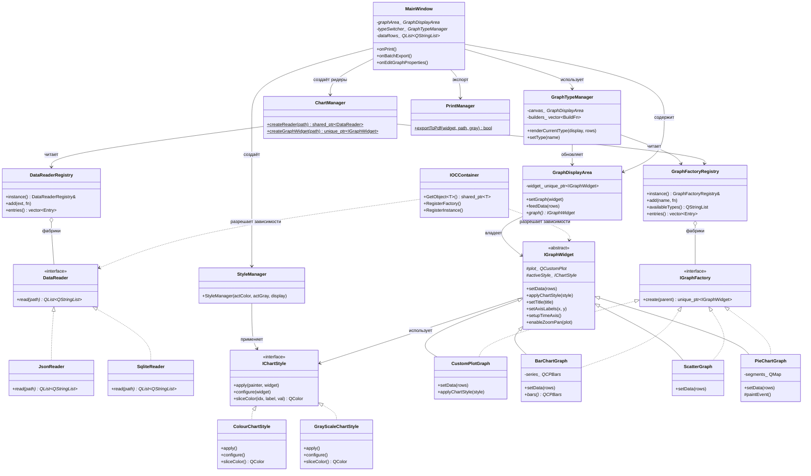

# Chart Viewer — лабораторная работа №3

Qt-приложение для визуализации временных рядов с применением паттернов проектирования:
**IoC-контейнер**, **Стратегия**, **Реестр фабрик** и **Фасад**.

---

## Возможности

| Функция | Описание |
|---|---|
| Форматы данных | JSON, SQLite |
| Типы графиков | Line, Bar, Scatter, Pie |
| Стили | Цветной / Чёрно-белый |
| Экспорт | PDF |
| Пакетный экспорт | Целая папка файлов за один проход |
| Файловый браузер | Встроенный QTreeView с навигацией |

---

## Архитектура

```
src/
├── IOC_Container.h/.cpp          — IoC-контейнер (type-id + фабрики)
├── MainWindow.h/.cpp             — главное окно, оркестратор
├── PrintManager.h                — экспорт в PDF (QPdfWriter)
├── DataReaders/
│   ├── DataReader.h              — интерфейс (Strategy)
│   ├── DataReaderManager.h       — реестр + макрос REGISTER_DATA_READER
│   ├── JsonReader.h/.cpp
│   └── SqliteReader.h/.cpp
└── Chart/
    ├── IGraphWidget.h/.cpp       — базовый виджет графика
    ├── GraphDisplayArea.h        — контейнер текущего графика
    ├── IGraphFactory.h           — интерфейс фабрики
    ├── GraphFactoryRegistry.h    — реестр + макрос REGISTER_GRAPH_FACTORY
    ├── ChartManager.h/.cpp       — фасад: createReader / createGraphWidget
    ├── GraphTypeManager.h/.cpp   — переключатель типа графика (комбо-бокс)
    ├── CustomGraphs/
    │   ├── CustomPlotGraph.h/.cpp  — линейный граф
    │   ├── BarChartGraph.h/.cpp    — столбчатый граф
    │   ├── ScatterGraph.h/.cpp     — точечный граф
    │   └── PieChartGraph.h/.cpp    — круговая диаграмма
    └── Style/
        ├── IChartStyle.h           — интерфейс стиля (Strategy)
        ├── ColourChartStyle.h/.cpp — цветной стиль
        ├── GrayscaleChartStyle.h   — монохромный стиль
        └── StyleManager.h/.cpp     — применяет стиль по кнопке тулбара
```

---

## Диаграмма классов



---

## Паттерны проектирования

### IoC-контейнер (`IOCContainer`)
Хранит фабричные функции, привязанные к `type_id` типа. Позволяет получить любую зависимость через `GetObject<T>()` без знания конкретного класса.

```cpp
// Регистрация
gContainer.RegisterFactory<IGraphWidget, CustomPlotGraph>();
// Получение
auto graph = gContainer.GetObject<IGraphWidget>();
```

### Стратегия — DataReader
Каждый ридер (JSON, SQLite) реализует `DataReader::read()`. Конкретный ридер выбирается по расширению файла через `DataReaderRegistry`.

```cpp
auto reader = ChartManager::createReader("/path/to/file.json");
auto *rows  = reader->read("/path/to/file.json");
```

### Реестр фабрик — GraphFactoryRegistry
Макрос `REGISTER_GRAPH_FACTORY` регистрирует виджет в глобальном реестре при инициализации статики:

```cpp
REGISTER_GRAPH_FACTORY("Line", CustomPlotGraph)
REGISTER_GRAPH_FACTORY("Bar",  BarChartGraph)
```

`GraphTypeManager` заполняет комбо-бокс из реестра и создаёт нужный виджет по выбору пользователя.

### Стратегия — IChartStyle
`ColourChartStyle` и `GrayScaleChartStyle` реализуют `configure()` для каждого типа графика через `dynamic_cast`. Применяются без пересоздания виджета.

---

## Сборка

```bash
git clone <url>

mkdir build && cd build
qmake ../IocContainer.pro
make -j$(nproc)

./IocContainer
```

**Зависимости:** Qt 5.15+, модули `core gui sql printsupport concurrent`, библиотека QCustomPlot (включена в `includes/`).

---

## Работа с приложением

1. В файловом браузере (левая панель) дважды кликните на файл `.json` или `.sqlite`.
2. Данные загрузятся асинхронно; прогресс показывается диалогом.
3. Выберите тип графика из выпадающего списка на тулбаре.
4. Кнопки **Цветной** / **Ч/Б** переключают стиль без перезагрузки данных.
5. Кнопки тулбара: **Печать в PDF**, **Настройки осей**, **Пакетный экспорт**.

---

## Структура входных данных

Файлы должны содержать два поля: **дата/время** и **числовое значение**.

**JSON:**
```json
[
  {"Time": "01.01.2024 08:00", "Value": 5.2},
  {"Time": "01.01.2024 09:00", "Value": 6.1}
]
```

**SQLite:** таблица с двумя колонками; первая — дата, вторая — число.
